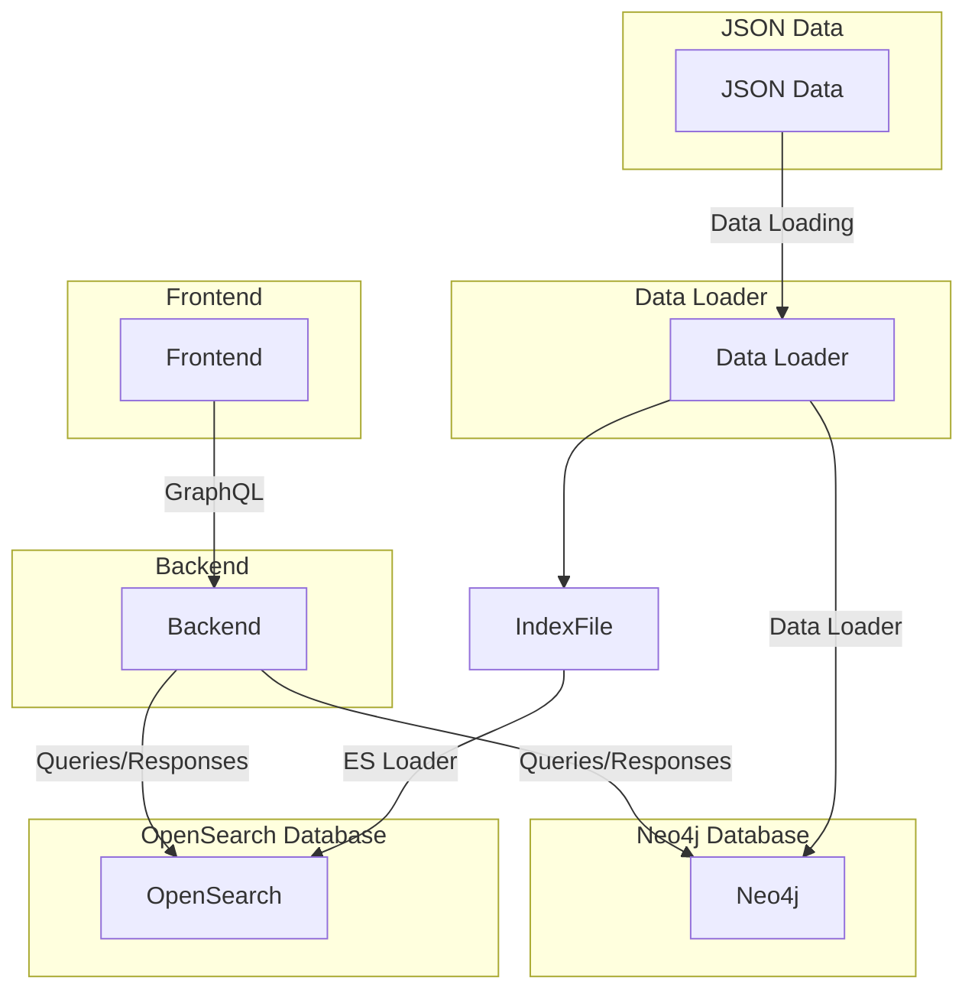

# crdc-ctdc-starter-kit

## Components:
<ul>
  <li>Frontend [?]: Represents the user interface and client-side of the web application.</li>
  <li>Backend [crdc-ctdc-backend]: Represents the server-side of the web application, responsible for handling business logic and communicating with databases.</li>
  <li>Data Loader [icdc-dataloader]: A service responsible for loading data into databases.</li>
  <li>Neo4j Database: A graph database used to store and manage data.</li>
  <li>OpenSearch Database: A search engine/database used to store and index data.</li>
  <li>JSON Data: Represents the data in JSON format, which needs to be loaded into the databases.</li>
  <li>IndexFile: A file containing information needed to index data in the OpenSearch database.</li>
</ul>

## Communication Flow:

<ul>
  <li>The Frontend communicates with the Backend using GraphQL. GraphQL is a query language for APIs that allows the Frontend to request specific data from the Backend.</li>
  <li>The Backend communicates with both the Neo4j and OpenSearch databases to perform queries and handle responses. The Backend is responsible for orchestrating data retrieval and storage.</li>
  <li>The JSON Data is used to load data into the Data Loader service, which is responsible for processing and preparing the data for storage in the databases.</li>
  <li>The Data Loader service is connected to both the Neo4j and OpenSearch databases. It loads the processed data into the Neo4j database.</li>
  <li>Additionally, the Data Loader service uses the IndexFile to help load data from the Neo4j database into the OpenSearch database using the ES Loader (Elasticsearch Loader).</li>
</ul>

## System diagram

